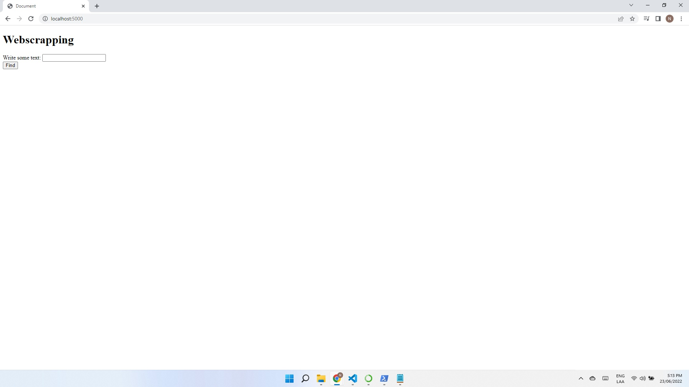
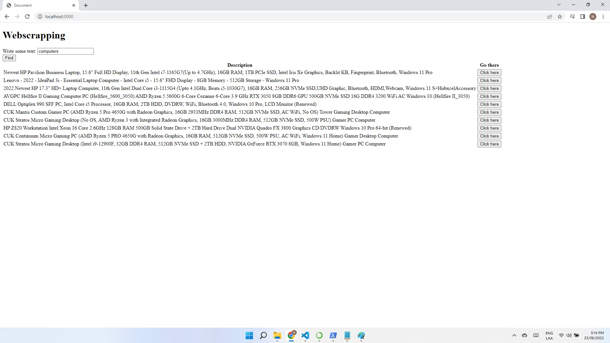
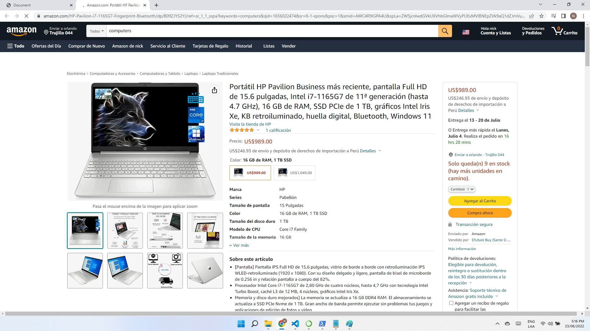

# Webscrapping Amazon with python

## How to run this project
You can use anaconda for this, then you will open the prompt and in the root folder you will write python .\app.py and can run this project

## How it works
- In this project when you run it you will see this website

- Then you can type any product to search, for this short sample we wrote "computer" and when I press on find button you will see this results, in this case we show just first 10 results

And when we click on each button will show you the results in amazon, the list of results are based on same search you will make in amazon official website so I made a webscrapping to get that results in my website. 

